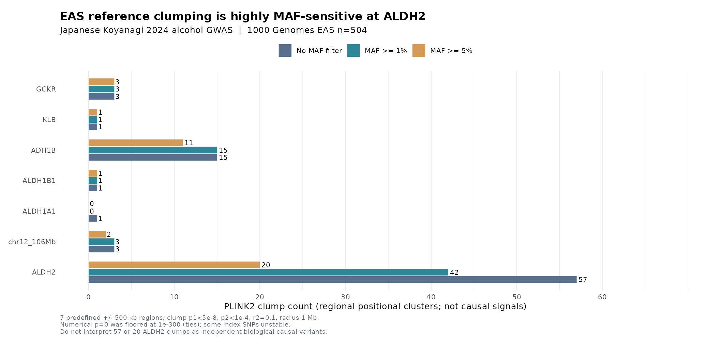

# IS Phase G0022 — Japanese alcohol GWAS seven-region EAS LD-clumping and pleiotropy gate
**Date:** 2026-10-10 KST
**Branch:** `research/is-broad-discovery-20261009`
**Interpretive status:** VERIFIED REGIONAL ASSOCIATION CLUMPS, **NOT 81 INDEPENDENT CAUSAL SIGNALS**, NO VALID MR ESTIMATE

## 1. Scope and reproducible data

This extends the previous **7 exact sentinel pairwise LD analysis** (EAS n=504, JPT n=104) to ALL accessible Japanese alcohol GWAS associations in seven preselected neighborhoods. The study's original full Zenodo v1 alcohol-intake genome-wide source (Koyanagi 2024, verified file MD5 `a37efa6044605f187d93866d162b2026`) was scanned again in full: **7,676,853** variant rows. Each predefined locus used ±500kb around one sentinel: GCKR, KLB, ADH1B, ALDH1B1, ALDH1A1, chr12:106.75Mb, and ALDH2 rs671.

We extracted official 1000 Genomes Phase 3 **GRCh37 v5b** genotype VCF ranges with bcftools indexed access and **all 504 EAS reference participants**, confirmed VCF sample identity/order against the source sample list, and converted them to PLINK2 pgen. Seven regions span four chromosomes; the original EAS biallelic SNP reference includes:

| Chromosome | Regional intervals | Exact 1KG EAS SNPs |
| --- | --- | ---: |
| chr2 | GCKR ±500kb | 24,914 |
| chr4 | KLB ±500kb; ADH1B ±500kb | 51,883 |
| chr9 | ALDH1B1 ±500kb; ALDH1A1 ±500kb | 52,972 |
| chr12 | chr12:106.75Mb ±500kb; ALDH2 ±500kb | 50,193 |
| **Total** | **7 regions** | **179,962** |

### The allele matching and clumping source universe

All 7.68 million original rows were screened, requiring source chromosome/position, true biallelic SNV, GWAS EA/NEA consistent with SNP alleles, and EAS reference exact REF/ALT pair (allowing reversed REF/ALT reference representation); palindromic SNPs were conservatively excluded. Source p-value cutoff for clump index was `p1 < 5e-8`; secondary GWAS evidence threshold `p2 < 1e-4`.

| Chromosome | Source-GWS records in predefined regions before allele QC | EAS reference matched GWS | All matched p<1e-4 |
| --- | ---: | ---: | ---: |
| chr2 | 94 | 84 | 152 |
| chr4 | 1,015 | 850 | 1,319 |
| chr9 | 12 | 7 | 12 |
| chr12 | 1,485 | 1,274 | 1,329 |
| **Total** | **2,606** | **2,215** | **2,812** |

The previous **1,036 GWS SNPs** count referred to a more stringent **non-ALDH2 genome-wide screen with EAF and phenotype-specific QC**. It is not comparable with the 2,606 in this predefined seven-region inclusive analysis. Most source SNPs in this analysis belong to ALDH2 and ADH1B neighborhoods. Excluding palindromic variants protects against ambiguous strand-orientation but reduces coverage; some high-LD proxies may not be selected. This is NOT an unconditional proof that all genome-wide significant alcohol SNPs have been clumped.

An important numerical limitation: **507 clump-input rows had raw source GWAS p=0**, due to numerical underflow, and were mapped to a conservative finite `1e-300` only for PLINK execution. This preserves GWS significance but creates p-value ties at the top of the ALDH2 locus. A PLINK clump index selected among tied p values is **not a unique prioritized biological candidate**; original source beta/SE and genome build should be used in any subsequent signal ranking.

## 2. Actual PLINK2 regional clumping

Reference software: PLINK2 v2.00a6. Shared clumping thresholds: `--clump-p1 5e-8 --clump-p2 1e-4 --clump-r2 0.1 --clump-kb 1000`. Only the referenced ±500kb neighborhoods were extracted; radius 1Mb does not magically include genotype variants outside the acquired neighborhoods.

| Region | No MAF threshold | MAF ≥1% | MAF ≥5% |
| --- | ---: | ---: | ---: |
| GCKR (chr2) | 3 | 3 | 3 |
| KLB (chr4) | 1 | 1 | 1 |
| ADH1B (chr4) | 15 | 15 | 11 |
| ALDH1B1 (chr9) | 1 | 1 | 1 |
| ALDH1A1 (chr9) | 1 | **0** | **0** |
| Other chr12:106.75Mb | 3 | 3 | 2 |
| **ALDH2 rs671 neighborhood** | **57** | **42** | **20** |
| **Total** | **81** | **65** | **38** |

The crude clump count drops from **81 → 38** with MAF≥5%. Most instability is around ALDH2, which goes from **57 → 20**. In the unrestricted 81 regional clump indices, **17** have EAS MAF below 1%, **26** have EAS MAF 1–5%, and 7 clump indices have source p underflow and clamped p of 1e-300. The uncommon ALDH1A1 lead has original Japanese EAF 0.9806, implying source minor allele frequency ≈1.94%, and is absent from the MAF-filtered EAS reference; this is a **frequency/coverage limitation, not proof the alcohol association disappears**. At the full EAS n504 reference it is a rare variant and cannot be a confidently precise proxy for conditional analyses.

### Threshold-r² dependence
At **MAF≥1%** for the more complex chr4 and chr12 groups:

| Chromosome | r²=0.1 clumps | r²=0.2 clumps | r²=0.5 clumps |
| --- | ---: | ---: | ---: |
| chr4 | 16 | 20 | 45 |
| chr12 | 45 | 59 | 114 |

Increasing the minimum (r^2) needed to assign a member to a clump causes more clumps (fewer variants are absorbed). This further demonstrates **sensitivity to arbitrary clumping hyperparameters** rather than proof of novel independent causal signals.

### Primary index assignment of the original seven sentinels
Six of the original seven source-GWS sentinels are selected as clump indices in unrestricted analysis: GCKR, KLB, ADH1B, ALDH1B1, ALDH1A1, chr12:106.75Mb. **ALDH2 rs671 is assigned as a member of the `12:111827203:G:A` index clump**. This is because ALDH2 study p values underflow to 0 and are clamped/tied. It **does not** imply rs671 is removed, loses its functional coding impact, or is statistically proven subordinate to `12:111827203:G:A`.

## 3. Causal inference gates after regional clumping

**What changed compared with the 7-SNP exercise:** a real EAS panel now covers **179,962 biallelic reference SNPs**, allowing formal PLINK2 regional clumping of the **2,215** association-GWS SNPs that survived source/ref harmonization, with 2,812 matched variants above the secondary clump p threshold.

**What remains scientifically blocked:**
- **Regional clumps ≠ conditionally independent GWAS effects or SuSiE credible sets.** 504 reference individuals and unadjusted, locus-restricted LD cannot establish the causal count in complex ALDH2 signal. A proper GWAS sample-size-aware conditional analysis with LD compatibility and an independent ancestry-matched validation set is needed.
- **Brittle source p=0 ranking:** 507 source summary rows are tied after finite flooring. Need harmonized beta/SE ranking and/or log-tail algorithms rather than interpreting PLINK's arbitrary index as an independent lead.
- **No valid, causally specific alcohol instruments yet:** ADH1B and ALDH1B1 are alcohol/aldehyde metabolism enzymes; GCKR and KLB are broader metabolic/endocrine signals; ALDH2 rs671 is functional coding with direct acetaldehyde/vascular implications. The IV **exclusion restriction**, absence of horizontal pleiotropy, and mediator-specific relevance are not demonstrated by clumping.
- **Cohort overlap not quantified:** published Japanese exposure GWAS includes BBJ, and shared BBJ BP/stroke/GIGASTROKE EAS participants could bias naive two-sample MR.
- **No new valid IVW, MR-Egger, weighted median, Cochran Q, or alcohol/BP-mediated AIS proportion is reported.** The absence of individual AIS p<0.05 among five non-ALDH2 candidates is not itself a valid MR-instrument rejection criterion.
- **No final ALDH2 target or drug repurposing assertion.** Maintain the broad **2,225 positional IS genes** and do not transfer within-locus functional coding evidence to generic genome-wide causality.

**Recommended next data milestone:** Obtain a Japanese-/EAS-cohort matched LD panel of adequate size and correct case-control effective N, then conditional fine mapping of the whole ALDH2 and ADH1B region. Pursue separate plasma and tissue cis-pQTL/eQTL source coverage, orthogonal protein assays, and independently sampled EAS ischemic-stroke GWAS. Address study overlap explicitly before any MR.

## 4. Figure for manuscripts



The plot is descriptive and not a causal fine-mapping result.

## 5. Reproducibility

```bash
cd /srv/is-analysis/worktrees/is-broad-discovery-20261009

# Default is PLAN ONLY, does not mutate data or fetch references
python3 scripts/is/extract_alcohol_eas_region_reference_for_clump.py
# Explicitly acquire official phase3 EAS 504 participant ±500kb windows
python3 scripts/is/extract_alcohol_eas_region_reference_for_clump.py --execute

# Full 7,676,853-row Japanese source, allele harmonization, clump-input creation
python3 scripts/is/prepare_alcohol_gws_regional_clump.py

ROOT=/srv/is-analysis/results/is/stage5_functional/broad_discovery_v1/expanded_reference_v2/g0022_full_locus_ais_v1/alcohol_gws_regional_clumping
REF=/srv/is-analysis/data/is/ld_reference/alcohol_region_clump_eas_20261010
for c in 2 4 9 12; do
  for maf in 0 0.01 0.05; do
    # base uses no --maf, the optional threshold variants use --maf
    if [ "$maf" = 0 ]; then
      plink2 --pfile "$REF/chr${c}.EAS504.regions" \
        --clump "$ROOT/chr${c}.alcohol_regional.clump_input.tsv" \
        --clump-p1 5e-8 --clump-p2 1e-4 --clump-r2 .1 \
        --clump-kb 1000 --out "$ROOT/chr${c}.EAS504.alcohol_r2_0p1"
    else
      plink2 --pfile "$REF/chr${c}.EAS504.regions" --maf "$maf" \
        --clump "$ROOT/chr${c}.alcohol_regional.clump_input.tsv" \
        --clump-p1 5e-8 --clump-p2 1e-4 --clump-r2 .1 \
        --clump-kb 1000 --out "$ROOT/chr${c}.EAS504.alcohol_maf_${maf}_r2_0p1"
    fi
  done
  plink2 --pfile "$REF/chr${c}.EAS504.regions" \
    --freq --out "$REF/chr${c}.EAS504.regions"
done
# Additional chr4/chr12 r² .2/.5 sensitivity follows the same naming
python3 scripts/is/audit_alcohol_eas_regional_clump_sensitivity.py
Rscript scripts/is/plot_is_alcohol_regional_clump_maf_sensitivity.R
OPENBLAS_NUM_THREADS=1 python3 -m unittest discover -s tests -p 'test_is_*' -q
```

All original 1KG genotype data and original full Japanese GWAS are stored in the user's server **outside version control**. The Git branch tracks only scripts, synthetic regression tests, figure and this research report.

Main derived artifacts:
- `IS_ALCOHOL_REGIONAL_GWAS_REFERENCE_COVERAGE.json`: each chr's source GWS/allele match/QC
- `IS_ALCOHOL_7REGION_CLUMP_SENSITIVITY.tsv`: seven regions by MAF threshold
- `IS_ALCOHOL_7REGION_CLUMP_INDEX_EVIDENCE.tsv`: actual lead reference MAF/underflow/association membership
- `IS_ALCOHOL_7REGION_CLUMP_SENSITIVITY_AUDIT.json`: aggregation and inferential gates

**Primary data links:** Koyanagi 2024 Japanese alcohol GWAS `https://zenodo.org/records/10038152`; 1000 Genomes Phase3 `https://ftp.1000genomes.ebi.ac.uk/vol1/ftp/release/20130502/`; GIGASTROKE stroke GWAS `https://www.nature.com/articles/s41586-022-05165-3`.

### Safe automated rerun

The exact 20-task PLINK2 clumping / MAF frequency grid is preserved in `scripts/is/run_alcohol_eas_regional_clumping.py`. Default execution is **plan only**; `--execute` reruns 16 PLINK clumping permutations and four reference allele-frequency computations, then invokes fail-closed evidence auditing. All 20 procedures were rerun successfully with identical total/sentinel assignments, and **causal_eligible_MR_IVs remains 0**.

```bash
python3 scripts/is/run_alcohol_eas_regional_clumping.py          # plan only
python3 scripts/is/run_alcohol_eas_regional_clumping.py --execute # explicit research-only rerun
```
