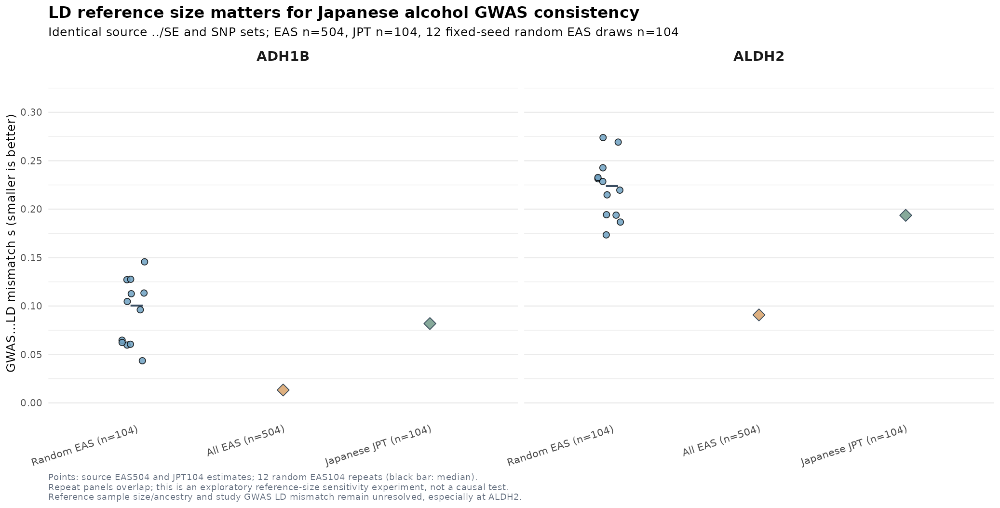

# IS G0022 — Japanese alcohol GWAS LD reference population and size sensitivity
**Date:** 2026-10-10 KST
**Branch:** `research/is-broad-discovery-20261009`
**Scientific gate:** **ALDH2 BLOCKED; ADH1B EXPLORATORY**. No new causal variant, gene, mediation effect or MR estimate.

## Executive finding

We reconstructed signed, allele-aligned LD for **the exact same ADH1B 637 SNPs and ALDH2 574 SNPs** with three actual reference conditions:
- **Original 1KG EAS 504 individuals** from the 1000 Genomes Phase 3 GRCh37 `20130502 v5b` VCF.
- **Japanese JPT 104 individuals**, a true subset of those EAS 504, using verified official 1KG population labels, no changes in SNP order/allele orientation.
- **Twelve fixed-seed random 104-subject subsamples from the full 504-person EAS panel**, using the identical source beta/SE-derived Japanese GWAS z scores and the same original SNP set. These correlated draws are exploratory panel-size controls, not an independent-data bootstrap for causal-effect inference.

Reconstructing the original EAS signed LD from source `plink2 --export Av` genotypes gave **maximum matrix element absolute difference = 0** in both ADH1B and ALDH2. This eliminates a silent REF/ALT sign flip or SNP ordering error *in the current reconstruction*, but does not attest GWAS-study/LD sample ancestry matching.

### Primary comparison: identical SNP list, no reference-dependent allele-frequency filtering

| GWAS exposure locus | Retained original SNPs | Source GWAS median SNP N | EAS504 `estimate_s_rss` s | JPT104 fixed same-SNP s | Random EAS104 median s (12 draws) | Random EAS104 minimum–maximum s |
|---|---:|---:|---:|---:|---:|---:|
| ADH1B, chr4 | **637** | 154,559 | **0.0133127** | **0.0819087** | **0.100403** | **0.043533–0.145639** |
| ALDH2 rs671 chr12 | **574** | 154,570 | **0.0908385** | **0.193627** | **0.224092** | **0.173470–0.273877** |

**The JPT104 s value lies inside the range of the twelve random 104-sample EAS panels for BOTH loci.** This indicates loss of reference sample size can plausibly account for much of the elevated small-panel mismatch. It does NOT identify that as the only mechanism: JPT/EAS haplotypes, original GWAS cohort ancestries, unmeasured study population LD, SNP selection and summary statistic covariance can all matter. The random control replicates reuse the same parent panel and are NOT independent studies. Do not use their empirical range as a confidence interval or interpret a rank as a calibrated p-value.

For transparency, an earlier **panel-specific AF-filtered** comparison produced JPT s=0.0823544 at ADH1B (634 SNP) and s=0.185898 at ALDH2 (564 SNP). **Those results use different SNP sets than EAS504** (637/574) and must not be the primary head-to-head values. The fixed identical-SNP comparison (JPT s=0.0819087 / 0.193627) is the scientific primary comparison going forward. Panel-specific AF threshold results are still available as **secondary filtering sensitivity** and are not mixed into the fixed-SNP panel-size experiment.



The chart is a **QC diagnostic**, not a causal graph. Source original β/SE and SNP selection are held fixed in the primary comparison, and only the genotype reference composition/size changes.

## 1. Reproducible source and quality controls

Public input:
- Koyanagi et al. 2024 Japanese alcohol-intake GWAS original downloaded source: `/srv/is-analysis/data/is/gwas_exposure/japanese_alcohol_2024/1_Alcohol_intake_Unstratified.tsv.gz` (original Zenodo source MD5 independently verified in earlier milestone).
- 1000 Genomes Phase3 v5b GRCh37 genotype variants previously selectively downloaded by genomic interval and retained in `/srv/is-analysis/data/is/ld_reference/alcohol_region_clump_eas_20261010`. Genuine EAS genotype participant count **504**, JPT participant count **104** (from `integrated_call_samples_v3.20130502.ALL.panel`).

Source prepared via `scripts/is/prepare_alcohol_aldh2_adh1b_conditional_susie.py`:
`/srv/is-analysis/results/is/stage5_functional/broad_discovery_v1/expanded_reference_v2/g0022_full_locus_ais_v1/alcohol_conditional_susie_v1/{ADH1B,ALDH2}/`

Selected MAF≥5%, original Japanese GWAS-versus-EAS AF difference≤0.10, N≥100,000, source original p<1e-4, excluded palindromic SNPs. Direct original effect beta/standard error used, retaining p=0 as an **underflow marker** not a value used to infer z. Source `reference_eas504.traw` export includes complete 504 sample IDs and 637/574 biallelic SNPs. Every exported COUNTED/ALT pair was tested against source REF/ALT and original EAS signed LD was reconstructed to exactly the saved original matrix. All original SNP IDs and order were kept for JPT n104; JPT monomorphic variants: **0** in both loci. The JPT LD rank is at most **103** (n104 minus 1) for over 500 SNPs: sample covariance is singular and estimated correlations are uncertain.

For random controls, seed `20261010`, 12 different 104-sample sets drawn without replacement from EAS504. Exactly the same sample-selection indices were applied to ADH1B and ALDH2 across chromosomes. All 24 matrix draws completed without encountering monomorphic variants, and every output carries genotype and source provenance metadata. Same true GWAS z scores used for all draws, no artificial association generation.

## 2. Why the data cannot be promoted to a valid causal fine-map

- For the larger original EAS504 panel, **ALDH2** still fails the internal *exploratory* s≤0.05 consistency gate with **s≈0.0908**. Switching to JPT n104 does not fix it; it increases s to **≈0.1936** on the same SNP set.
- **ADH1B** remains an exploratory SuSiE-only result with original EAS504 s≈0.0133, but the previously verified full versus restricted-SNP model instability persists: 3–6 exploratory CS, and different highest-PIP variants across filters. JPT104 s≈0.0819 cannot be used to claim population-valid conditional independence.
- `estimate_s_rss` measures regularized GWAS–LD consistency and is not proof of allele harmonization correctness in the original cohort, a universally calibrated threshold, or a complete physical model for finite-LD sampling uncertainty. We choose a conservative internal stop threshold, not a field-wide standard.
- The server's installed **susieR v0.14.2** exposes neither `R_finite` nor `R_mismatch` arguments in `susie_rss`. Those options are documented in the newer 2026 SuSiE-RSS vignette; **we have not installed or activated a separate new version**. Do not describe our current models as finite-reference-LD-corrected.
- Koyanagi Japanese alcohol GWAS includes BBJ participants, possible reuse across BBJ stroke/BP and GIGASTROKE East Asian AIS GWAS has not been measured or ruled out. ALDH2 rs671 affects ethanol/acetaldehyde handling as well as drinking behavior, so direct enzymatic/vascular effects and horizontal pleiotropy remain unresolved.
- No independent Korean/Japanese ischemic stroke case/control dataset is validated by these exposure LD diagnostics. No SMR/HEIDI/coloc or Two-sample MR is promoted based on these data.

**Current outcome:** Japanese-matched population frequency improves versus EAS for some SNPs, but **104 reference individuals is worse for stable LD covariance estimation** than the full 504. Larger truly Japanese/study-matched haplotype data or joint-study GWAS LD are needed to re-evaluate ALDH2. A JPT-restricted 53-SNP "low s" selection does not repair missing full-locus genomic signals.

The primary **IS 2,225 positional candidate genes remain unchanged**, and existing canonical GWAS/prod services were not modified.

## 3. Executed audit / outputs

```bash
cd /srv/is-analysis/worktrees/is-broad-discovery-20261009
OPENBLAS_NUM_THREADS=1 python3 scripts/is/prepare_alcohol_jpt104_ld_sensitivity.py
OPENBLAS_NUM_THREADS=1 Rscript scripts/is/audit_alcohol_jpt_eas_ld_mismatch.R
# Mandatory exact same 637/574 SNP benchmark
OPENBLAS_NUM_THREADS=1 Rscript scripts/is/audit_alcohol_jpt_eas_fixed_set_ld.R
# 12 reproducible EAS 104-sample control matrices, fixed seed
OPENBLAS_NUM_THREADS=1 python3 scripts/is/prepare_alcohol_eas_n104_reference_controls.py
OPENBLAS_NUM_THREADS=1 Rscript scripts/is/audit_alcohol_eas_n104_reference_controls.R
# Fail closed even if small samples happen to produce numerically low s
python3 scripts/is/audit_alcohol_jpt_eas_reference_size_gates.py
Rscript scripts/is/plot_is_alcohol_jpt_eas_reference_size.R
OPENBLAS_NUM_THREADS=1 python3 -m unittest discover -s tests -p 'test_is_*' -q
```

Core results under the experimental research output folder:
- `ALCOHOL_EAS504_JPT104_FIXED_IDENTICAL_SNP_LD_MISMATCH.tsv` — preferred direct population/size comparison.
- `ALCOHOL_ALDH2_ADH1B_EAS504_VS_JPT104_LD_MISMATCH.tsv` — secondary AF threshold variants only, **not exact same-SNP**.
- `ALCOHOL_EAS104_RANDOM_DOWNSAMPLING_LD_MISMATCH.tsv` — all 24 repeated diagnostic estimates.
- `IS_ALCOHOL_JPT_EAS_REFERENCE_SIZE_SCIENTIFIC_GATE.json` — strict research interpretation boundaries.
- `ADH1B/JPT104_sensitivity/` and `ALDH2/JPT104_sensitivity/` — local individual-derived signed LD matrices and source QC (not committed).
- `ADH1B/EAS104_random_reference_controls/` and `ALDH2/EAS104_random_reference_controls/` — 24 local LD matrices and 12-panel manifests (not committed).

Source data and participant genotype exports stay on the authorized local research server and are excluded from Git. Only reproducibility scripts, synthetic test fixtures, this report and small original Figure are versioned.

## 4. Next independent-data milestone

The priority is to obtain a much larger Japanese-origin LD reference (or study GWAS cohort-specific covariance/LD) with usable license and harmonized genomic build, and explicitly verify population-specific LD plus per-variant GWAS sample N. Independently replicate AIS and seek full-regional cis eQTL/pQTL credible sets for ADH1B and ALDH2; do not overinterpret rs671's protective AIS association as an alcohol-mediated or enzyme-mediated treatment effect until those pathway hypotheses are separately tested.

**References**
- Koyanagi et al. 2024 Japanese alcohol GWAS: https://pmc.ncbi.nlm.nih.gov/articles/PMC10816704/
- Original published source: https://zenodo.org/records/10038152
- IGSR / 1000 Genomes Phase3: https://www.internationalgenome.org/data
- SuSiE-RSS 2026 reference LD uncertainty: https://stephenslab.github.io/susieR/articles/rss_mismatch.html
- SuSiE summary statistics LD diagnostics: https://stephenslab.github.io/susieR/articles/susierss_diagnostic.html
