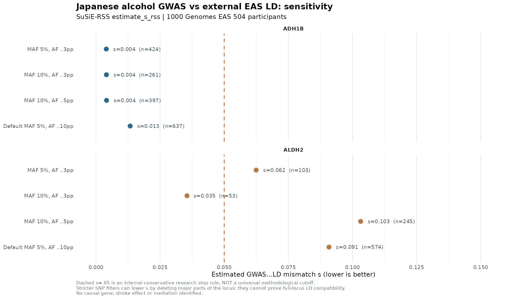
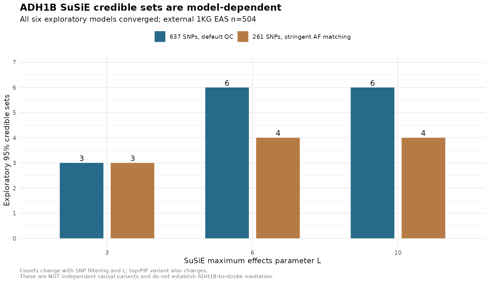

# IS G0022 Mechanistic Branch — Real Japanese Alcohol GWAS ADH1B / ALDH2 Conditional Fine-Mapping Diagnostic
**Frozen research snapshot: 2026-10-10 KST**
**Branch:** `research/is-broad-discovery-20261009`
**Scientific classification:** **ALDH2 GWAS–LD mismatch BLOCKED. ADH1B SuSiE EXPLORATORY, filter/L unstable. No verified causal fine-map or alcohol → stroke mediation.**

## Executive result

After the previous 7-locus EAS GWAS regional clumping experiment, we evaluated the two primary enzymatic loci ADH1B (chr4) and ALDH2 rs671 (chr12) using the original **Koyanagi et al. 2024 Japanese alcohol-intake GWAS** actual **variant-level effect β, standard error and per-SNP N**, harmonized allele signs and **signed** (not absolute or squared) SNP-by-SNP LD computed from **all 504 1000 Genomes EAS Phase 3 GRCh37 individuals**.

This is an **exposure** fine-mapping diagnostic, not an ischemic-stroke fine-map, and does NOT provide a formal instrument validity check. No ischemic-stroke summary statistic was used in the exposure-only SuSiE model.

| Metric | ADH1B | ALDH2 |
|---|---:|---:|
| ±500kb original GWAS/reference allele-matched SNPs with p<1e-4 (before stronger QC) | 1,158 | 1,279 |
| Retained signed ALT genotypes | **637** | **574** |
| EAS reference individuals | 504 | 504 |
| Real GWAS per-SNP sample N | **154,559**, identical across selected variants | **147,624–154,570**, median 154,570 |
| Source p numeric zero underflow among selected variants | **0** | **442** |
| Max original |β/SE| | **20.24** | **178.58** |
| `estimate_s_rss` GWAS–LD mismatch s | **0.01331267** | **0.09083855** |
| Conservative internal s≤0.05 research gate | **Exploratory model allowed** | **BLOCKED** |
| SuSiE-RSS basic fit, L=6 | Converged, **6 exploratory CS** | **Not run** |
| Validated causal effect(s) | **0** | **0** |
| Formal alcohol/BP/AIS mediated effect estimate | Not done | Not done |

Our s≤0.05 research stop threshold is an **internal conservative quality gate**, **NOT** a universal or validated community-standard significance criterion. Even a very low s does not guarantee a fine-map is truly causal; conversely the elevated ALDH2 mismatch is not proof that GWAS variants are wrong. It signals the **currently available EAS reference** is insufficiently concordant with the selected Japanese GWAS summary structure for an unqualified conditional inference.

### Exact methodological warning

SuSiE-RSS uses **the correlation matrix r signed by reference ALT** (not r², not abs(r)) to explain neighboring association z-scores. Because our external reference is a **small, ancestry-mixed EAS sample (n504)**, residual LD errors and phenotype-specific SNP coverage may lead to false extra signals or distorted PIPs. Current 2026 SuSiE-RSS methodological material explicitly warns about this. `estimate_s_rss` diagnoses consistency but does not itself repair mismatch.

Sources: https://stephenslab.github.io/susieR/articles/rss_mismatch.html and https://stephenslab.github.io/susieR/articles/susierss_diagnostic.html

## 1. Source provenance and allele alignment

Source Japanese GWAS: `1_Alcohol_intake_Unstratified.tsv.gz`, original Zenodo 10038152 MD5 `a37efa6044605f187d93866d162b2026`, previously verified over all 7,676,853 rows. Response scale: **log₂(grams/day + 1)**.

From the earlier seven-region allele audit (`IS_ALCOHOL_SOURCE_REF_MATCHED_REGIONAL_ASSOCIATIONS.tsv`), the two loci were selected by:
- original unadjusted region around **GRCh37 4:100239319 ADH1B** and **GRCh37 12:112241766 ALDH2 rs671**, radius ±500kb;
- source original association p<1e-4 (secondary clump threshold, deliberately not limited to GWS);
- direct source N≥100,000 and **EAS reference MAF ≥5%**;
- |Japanese GWAS ALT EAF − EAS reference ALT AF|≤10 percentage points;
- exact SNP position and REF/ALT source match, allowing reversed reference strandless REF/ALT orientation and disallowing ambiguous A/T and C/G reference SNPs.

Original **β/SE** was recovered directly by streaming the full validated original GWAS source again; **NO inversion from p=0** was used. Original effect allele was harmonized to **1000G VCF ALT**; actual `plink2 --export Av` COUNTED alleles were independently checked and doses complemented as `2−dosage` when required. Added an explicit assertion that the independently recomputed `z × SE` exactly reproduces reference ALT-aligned original β. The full signed LD was built from centered, standard-deviation-scaled allele dosage, with proper sample order and full float64 precision. The 504-person panel is not itself a study-matched large LD reference.

The p=0 underflow in 442 ALDH2 records is explicitly audited; original source β/SE remains finite and informative. It is incorrect to interpret p=0 as a literal probability of zero or as more proof of a unique causal SNP.

## 2. Primary conditional analysis

### ADH1B

With 637 source-verified common variants, `estimate_s_rss` gives s=**0.01331267**. The default exploratory `susie_rss(z, R, n=154559, L=6, max_iter=150, coverage=.95)` converged, with 6 **exploratory, LD purity-filtered** credible sets, of sizes **1, 1, 1, 2, 21, 24**. The highest PIP SNP was `4:100293600:C:T` (reported ~1.0 in the default model), and the original ADH1B rs1229984-region candidate `4:100239319:T:C` also received high model-dependent support.

This is **not** proof that six conditionally independent causal effects exist, nor that `4:100293600:C:T` is the true causal variant. With large original GWAS N relative to small external-LD N and non-study-matched LD, near-unit PIPs are particularly sensitive to variant selection and LD error.

### ALDH2

The original 574 variants included **442 original p=0 underflow records** but retained direct β/SE and allele-matched signed LD. Despite N=147,624–154,570 and reference AF checks, s=**0.09083855**. This fails our internal s≤0.05 gate. **We intentionally did not fit a full ALDH2 SuSiE model.** The reported 0 credible sets here means **NO MODEL RUN**, not a null genetic association and not evidence rs671 has no effect.

The previous GIGASTROKE EAS AIS full G0022 region SuSiE/CS analyses remain **separate outcome-specific results** and cannot substitute for this Japanese *alcohol exposure* LD/source QC.

## 3. AF / MAF restriction audit: s is filter-dependent

| Locus | Filter | Retained SNPs | Observed s | Research gate |
|---|---|---:|---:|---|
| ADH1B | MAF ≥5%, Japanese–EAS AF Δ≤10pp (default) | 637 | **0.01331** | Exploratory |
| ADH1B | MAF ≥10%, AF Δ≤5pp | 397 | 0.00410 | Exploratory |
| ADH1B | MAF ≥10%, AF Δ≤3pp | 261 | 0.00406 | Exploratory |
| ADH1B | MAF ≥5%, AF Δ≤3pp | 424 | 0.00400 | Exploratory |
| ALDH2 | MAF ≥5%, AF Δ≤10pp (default) | 574 | **0.09084** | **Blocked** |
| ALDH2 | MAF ≥10%, AF Δ≤5pp | 245 | **0.10318** | **Blocked** |
| ALDH2 | MAF ≥10%, AF Δ≤3pp | 53 | **0.03547** | Selective subset exploratory diagnostic only |
| ALDH2 | MAF ≥5%, AF Δ≤3pp | 103 | **0.06244** | **Blocked** |

The selective 53-SNP ALDH2 subset has apparently lower s but removes **521/574 variants (90.8%)** from the original model. This cannot be interpreted as repaired full-locus LD or robust ALDH2 conditional resolution. The 245-SNP subset actually increases mismatch to s=0.1032.



## 4. SuSiE L and variant-coverage robustness — ADH1B

We then ran **6 converged exploratory SuSiE-RSS models**, changing the assumed maximum number of effects (L=3,6,10) and allele matching filter. The exact per-SNP summary-effect N was 154559 for all default ADH1B variants.

| ADH1B candidate set | Number of SNPs | L=3 CS | L=6 CS | L=10 CS | Highest-PIP variant |
|---|---:|---:|---:|---:|---|
| Base MAF≥5%, AF Δ≤10pp | 637 | **3** | **6** | **6** | `4:100293600:C:T` |
| Restrict MAF≥10%, AF Δ≤3pp | 261 | **3** | **4** | **4** | `4:100243310:G:A` |

The highest PIP also changes: base model `4:100293600:C:T` nearly 1, but restricted model `4:100243310:G:A` about **0.52** at L=6. The **CS counts change 3 to 6** depending on L/filter and top candidate identity is not stable.

These are strong reasons to distinguish **experimental identification of genetic associations** from **final fine-mapping validation**. Stable biological function, independent ancestry-matched LD, ascertainment-adjusted functional evidence, and orthogonal QTL/assay validation remain necessary.



## 5. Pleiotropy, sample overlap and AIS independence — strict gates

The *entire* G0022 research retains the original 2,225 positional IS gene universe. This targeted study of the alcohol exposure branch does not replace the multiomic GWAS pipeline.

| Interpretation | Current evidence |
|---|---|
| rs671 A lowers Japanese/Korean alcohol consumption | **Verified source association** |
| rs671 A has Japanese/Korean BP association | **Verified source association** |
| rs671 A has significant GIGASTROKE EAS AIS association | **Verified source association** |
| Shared genetic variant proves drinking lowers stroke | **NO** |
| ADH1B 6 credible sets are independent causal alcohol effects | **NO** |
| ALDH2 conditional credible sets validated | **NO — default GWAS–LD diagnostic blocked** |
| ALDH2 directly lowers stroke via acetaldehyde metabolism | **NOT ESTABLISHED** |
| Non-ALDH2 instruments pass exclusion restriction / no horizontal pleiotropy | **NO** |
| Original BBJ-containing Japanese GWAS independent of BP/stroke | **NOT ATTESTED** |
| Independent EAS AIS outcome stroke GWAS replicates the effect | **NOT COMPLETED** |

Notably the independent ADH1B-region alcohol-intake candidate `4:100239319:T:C` was allele-matched to the EAS AIS original summary with AIS p≈0.366 in a previous audit. This non-significant single-outcome p-value is **not a valid reason alone to reject an otherwise strong genetic instrument**, and its alcohol effect does not prove a causal stroke null. ADH1B/ALDH2 enzymatic activities can influence aldehyde chemistry in addition to drinking behavior; GCKR/KLB have known broader metabolic contexts. Proper mediator-specific instrumental-variable exclusion restrictions and BBJ source overlap need explicit external evidence.

## 6. Executed source scripts, data and outputs

Research worktree:
`/srv/is-analysis/worktrees/is-broad-discovery-20261009`

Data/results (not uploaded into Git):
`/srv/is-analysis/results/is/stage5_functional/broad_discovery_v1/expanded_reference_v2/g0022_full_locus_ais_v1/alcohol_conditional_susie_v1/`

```bash
cd /srv/is-analysis/worktrees/is-broad-discovery-20261009
OPENBLAS_NUM_THREADS=1 python3 scripts/is/prepare_alcohol_aldh2_adh1b_conditional_susie.py

# Automatically runs only diagnostic-safe loci and explicitly blocks ALDH2
OPENBLAS_NUM_THREADS=1 OMP_NUM_THREADS=1 Rscript \
 scripts/is/run_alcohol_aldh2_adh1b_conditional_susie.R

# No SuSiE model run for the 574-SNP blocked ALDH2 region:
OPENBLAS_NUM_THREADS=1 OMP_NUM_THREADS=1 Rscript \
 scripts/is/audit_alcohol_aldh2_adh1b_ld_filter_sensitivity.R

# ADH1B six L-filter model sensitivity runs
OPENBLAS_NUM_THREADS=1 OMP_NUM_THREADS=1 Rscript \
 scripts/is/audit_alcohol_adh1b_susie_stability.R

# Science-gate aggregation; never elevates model PIP to causal proof
python3 scripts/is/audit_alcohol_aldh2_adh1b_conditional_scientific_gates.py
Rscript scripts/is/plot_is_alcohol_conditional_susie_sensitivity.R
OPENBLAS_NUM_THREADS=1 python3 -m unittest discover -s tests -p 'test_is_*' -q
```

Outputs:
- `ADH1B/input_qc.json`, `ALDH2/input_qc.json`
- `ADH1B/ALCOHOL_SUSIE_DIAGNOSTIC_AND_GATE.json`
- `ALDH2/ALCOHOL_SUSIE_DIAGNOSTIC_AND_GATE.json`
- `ADH1B/EXPLORATORY_SUSIE_PIP.tsv`
- `ALCOHOL_ADH1B_ALDH2_GWAS_LD_MISMATCH_FILTER_SENSITIVITY.tsv`
- `ALCOHOL_ADH1B_SUSIE_MODEL_STABILITY.tsv`
- `IS_ALCOHOL_ADH1B_ALDH2_CONDITIONAL_SCIENTIFIC_GATE.json`

### Next legitimate analysis

1. Obtain independent Japanese- or ancestry-and-cohort-matched phased LD at larger N, or original cohort LD/covariance when available, then rerun source-aware ALDH2 multi-signal analysis instead of taking only the 53 well-matched variants.
2. Apply newer LD-uncertainty-aware SuSiE-RSS as a **separate sensitivity branch** only if available/verified in the installed compatible version; do not silently replace the existing canonical SuSiE inputs.
3. Investigate major ADH1B alternative conditional signals with full regional pQTL/eQTL and cross-tissue/orthogonal assays and genome-build-matched functional annotation. Resolve 6-SNP-model L sensitivity before prioritizing a single ADH1B causal allele.
4. Audit Koyanagi BBJ participant reuse with stroke/BP cohorts, and find a truly independent Japanese/Korean/EAS ischemic stroke outcome dataset before quantitative mediation/MR.
5. Preserve all original GWAS, 2,225 IS positional genes, and stable research/production branches.

**References:** Original Japanese alcohol GWAS https://zenodo.org/records/10038152 ; Japanese GWAS paper https://pmc.ncbi.nlm.nih.gov/articles/PMC10816704/ ; 1000G phase3 reference https://ftp.1000genomes.ebi.ac.uk/vol1/ftp/release/20130502/ ; susieR diagnostics https://stephenslab.github.io/susieR/articles/susierss_diagnostic.html ; LD mismatch methodology https://stephenslab.github.io/susieR/articles/rss_mismatch.html .
