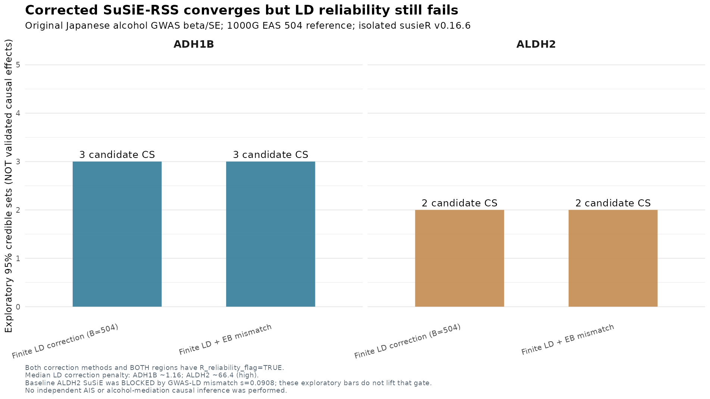

# IS G0022 — Finite-reference LD-corrected Japanese alcohol fine-mapping: isolated 2026 SuSiE-RSS validation

**Research date:** 2026-10-10 KST
**Branch:** `research/is-broad-discovery-20261009`
**Scientific gate:** **All four corrected experimental models converged, but all four trigger SuSiE-RSS LD reliability warnings. ALDH2 remains BLOCKED; ADH1B remains EXPLORATORY. No new causal SNP, gene, MR estimate, or alcohol-mediated AIS mechanism is established.**

## Executive findings

The original G0022 alcohol-exposure branch used Japanese Koyanagi et al. 2024 original genome-wide data (original signed per-variant β/SE and allele mapping, original source MD5 verified) with signed LD from 1000 Genomes Phase 3 EAS n=504. Previous `susieR 0.14.2` findings were: **ADH1B** exploratory 637 common SNPs, GWAS–LD mismatch `estimate_s_rss s=0.01331`, default L6 produced 6 exploratory credible sets and counts changed under variant selection; **ALDH2** 574 common SNPs, mismatch `s=0.09084`, conditionally fine-mapping BLOCKED because the LD reference was not sufficiently consistent with the source GWAS. JPT n=104 subgroup and matched 104-sample EAS controls further showed severe small-reference instability, not an ancestry-based resolution.

We verified official 2026 `susieR` support for `R_finite` and `R_mismatch` and **actually installed `susieR 0.16.6` in an isolated user-accessible R library**, leaving the server's default `susieR 0.14.2` intact. We ran both options on the complete previously QC-approved SNP sets as methods experiments only:

| Japanese alcohol-exposure locus | GWAS SNP count | Original s | Corrected model | Converged? | Exploratory 95% CS | `R_reliability_flag` |
|---|---:|---:|---|---|---:|---|
| **ADH1B** | 637 | **0.01331** | `R_finite=504` | YES | **3** | **TRUE — WARNING** |
| ADH1B | 637 | 0.01331 | `R_finite=504; R_mismatch="eb"` | YES | **3** | **TRUE — WARNING** |
| **ALDH2** | 574 | **0.09084** | `R_finite=504` | YES | **2** | **TRUE — WARNING** |
| ALDH2 | 574 | 0.09084 | `R_finite=504; R_mismatch="eb"` | YES | **2** | **TRUE — WARNING** |

Do **not** interpret the 2 corrected ALDH2 CS as two independent causal alcohol effects. The original ALDH2 GWAS–LD consistency gate remains blocked, and the newer method independently flags the corrected model as unreliable.

### Why convergence / large PIP does not imply a robust effect

- Across all four fits, **`R_sensitivity_flag=TRUE` and `R_reliability_flag=TRUE`**. These are flags reported by the actual model's `R_finite_diagnostics`, not invented study assessments.
- `R_finite` reports `B=504`, with `r_over_B≈0.01382` (ADH1B) and `≈0.00663` (ALDH2). Although effective-region-rank / B is modest, the **median per-variant finite-reference penalty** is ~**1.16** at ADH1B and ~**66.4** at ALDH2 (max penalty also captured in original JSON). This indicates substantial attenuation and sensitivity at ALDH2; one simple scalar cannot certify adequacy of the LD reference.
- `R_mismatch="eb"` estimated **`lambda_bias=0` and `B_corrected=504`** in both loci in this fitted configuration. Thus the empirical-Bayes population-mismatch component **did not introduce additional effective reference shrinkage** beyond `R_finite=504` and did not remove the reliability warning. Do not infer from zero that population LD mismatch is absent.
- The maximum PIP remained near 1 for both loci, including an ALDH2 top variant `12:111900807:T:C` rather than necessarily rs671. The same model warns that these fine-mapping results may be unreliable; **do not promote an unstable highest-PIP SNP into a causal-variant claim**, particularly when ALDH2 coding rs671 is known as a strong original marginal association.
- There is no original Japanese GWAS in-sample LD, no sufficiently large cohort-matched phased genotype panel, no resolved BBJ participant overlap, and no mediation-specific instrumental exclusion restriction. No independent AIS outcome replicated a mediated effect in this experiment.

### Figure



The Figure intentionally labels all corrected credible sets as **exploratory** and highlights the reliability failure. It must not be presented as evidence that the primary GIGASTROKE AIS G0022 outcome fine-map has two signals; this is **Japanese alcohol-exposure GWAS** only.

## 1. Software provenance and reproducibility

Public official documentation available 2026-10-10:
- Current `susie_rss` arguments `R_finite` and `R_mismatch`: https://stephenslab.github.io/susieR/reference/susie_rss.html
- Official LD mismatch vignette: https://stephenslab.github.io/susieR/articles/rss_mismatch.html
- `susieR 0.16.6` R-universe distribution: https://stephenslab.r-universe.dev/susieR

Downloaded and locally pinned source tarballs:
- `susieR_0.16.6.tar.gz`, SHA256 **`eab7570ad324081b705b6e313e93904491dadf2733eccacf15d154354e79f9bd`**
- `cpp11armadillo_0.5.4.tar.gz`, SHA256 **`00d1b1cab07b2e0c5a0249afc56eee2b87e9ea462bef525c55b4c31b292e4d8c`**

Installed R 4.3.3 isolated path:
`/srv/is-analysis/results/is/stage5_functional/broad_discovery_v1/expanded_reference_v2/g0022_full_locus_ais_v1/susie_rss_finite_ref_sandbox_v1/Rlib`

**Original default `susieR 0.14.2` remains installed and unchanged** in the server's regular R library path. New model scripts require version `>=0.16.6` with both arguments, error out otherwise, and write separately under `.../susie_rss_finite_ref_sandbox_v1/models/{ADH1B,ALDH2}/`. Original signed LD, source β/SE, no imputed GWAS in-sample LD and L=6 with max_iter=80 as a sensitivity benchmark. `n` is source locus median GWAS N, not a replacement for a true joint per-SNP sample covariance model.

```bash
cd /srv/is-analysis/worktrees/is-broad-discovery-20261009
SANDBOX=/srv/is-analysis/results/is/stage5_functional/broad_discovery_v1/expanded_reference_v2/g0022_full_locus_ais_v1/susie_rss_finite_ref_sandbox_v1
EXPOSURE=/srv/is-analysis/results/is/stage5_functional/broad_discovery_v1/expanded_reference_v2/g0022_full_locus_ais_v1/alcohol_conditional_susie_v1

# Existing package remains active when R_LIBS is omitted:
Rscript -e 'packageVersion("susieR")'  # 0.14.2

# Isolated package with finite-reference / EB correction:
R_LIBS="$SANDBOX/Rlib" Rscript -e 'packageVersion("susieR")'  # 0.16.6

# Both loci: 2 model configurations each, no canonical writes.
for loc in ADH1B ALDH2; do
 OPENBLAS_NUM_THREADS=1 OMP_NUM_THREADS=1 R_LIBS="$SANDBOX/Rlib" \
 Rscript scripts/is/run_alcohol_finite_ld_susie_sandbox.R \
   "$EXPOSURE" "$SANDBOX" "$loc"
done

# Strict flag audit; no causal publication-ready promotion:
python3 scripts/is/audit_is_alcohol_finite_ld_method_sandbox.py
Rscript scripts/is/plot_is_alcohol_finite_ld_sandbox.R
python3 -m unittest discover -s tests -p 'test_is_*' -q
```

The sandbox saves complete R model objects, SNP PIPs, per-configuration QC JSON, package pin/checksums, R build logs, and aggregate failure-of-reliability verdict. Do **not** commit genomic data or massive RDS files; the version-controlled branch contains only source code, synthetic tests, this report, and small Figure.

## 2. Japanese LD datasets: verified access policy versus theoretical sample sizes

**Crucial distinction: public allele frequencies are NOT individual genotypes or phase correlations needed for LD.** Large N does not mean the desired LD matrix is openly downloadable.

| Candidate | Japanese genetic dataset or panel | Potential N and source | Real ability to recompute our 574-SNP ALDH2 / 637-SNP ADH1B signed LD |
|---|---|---|---|
| 1000G JPT | GRCh37 JPT genotype subgroup | **104** — already used | **VERIFIED and USED**, but grossly undersized |
| 1000G EAS | GRCh37 full EAS reference genotypes | **504** — already used | **VERIFIED and USED**, source GWAS–LD mismatch unresolved |
| BBJ1K + 1KG EAS | NBDC-DDBJ Japanese imputation server | **1,037 Japanese BBJ + 504 EAS = 1,541**, controlled access | **NOT AUTHORIZED / NOT DOWNLOADED**. Imputation-server access requires approved JGA permission; panel may not provide direct extractable LD data even after approval |
| BBJ+1KG large imputation panel | 1KG+7K BBJ Japanese WGS panel, NBDC `JGAD000873` | **7,472 Japanese BBJ WGS plus 1KG Phase3** | **Controlled access**. Data use application/security review required; confirm data export scope and overlap before LD analysis |
| jMorp / ToMMo | 61KJPN Japanese genome-variation reference | ~**61,000**, public variant/genotype frequency summaries | **NO individual phased LD access verified**; a 61K allele-frequency report is not a 61K-person LD reference |
| Original Japanese alcohol GWAS cohorts | Study-specific LD/covariance from source contributors | Source GWAS up to 154,570 individuals at a variant | **Not obtained**. The scientifically ideal in-study ancestry- and sample-matched LD requires original investigator cooperation or explicitly approved re-analysis |

Support:
- Japanese BBJ population-specific 1KG+7K imputation reference paper: https://www.nature.com/articles/s42003-024-07338-4
- NBDC/BBJ access and dataset listings: https://biobankjp.org/en/researchers/2013 ; https://humandbs-production.ddbj.nig.ac.jp/dataset?order=desc&q=cohort%3A1000-genomes-project&sort=dateModified
- NBDC-DDBJ restricted reference panel access and available BBJ1K+1KG EAS n1541: https://pmc.ncbi.nlm.nih.gov/articles/PMC9768127/
- jMorp latest panel content distinguishes allele/genotype frequency from LD: https://jmorp.megabank.tohoku.ac.jp/docs/guide-en/overview/dataset_summary/

**Application guidance:** Request authorized **locus-level, ancestry-matched LD or SNP covariance matrices** covering GRCh37±500kb ALDH2 and ADH1B, with SNP IDs/alleles, retained sample count, QC thresholds, and permitted derivative sharing. Prefer study-level LD from GWAS analysts. If a controlled reference panel is approved, establish secure storage and permitted analysis environments before accessing anything. This branch does not bypass access controls or store new participants' individual genetic records.

## 3. Scientific decision and next gate

The tested method is implemented correctly and does reduce the number of exploratory CS relative to previous uncorrected ADH1B L6 (6 to 3); **it does NOT clear LD-mismatch QC or validate causality**. ALDH2 at ordinary `susieR 0.14.2` remained blocked and its experimental 2-CS result in 0.16.6 is flagged unreliable. **No model may be published as causal and no genetic instrument is promoted to MR-valid status** based on this experiment.

To make substantive biological progress, obtain approved larger Japan-ancestry or original Japanese GWAS study-specific LD and rerun allele-verified, same SNP-set SuSiE with `R_finite` and `R_mismatch="eb"`. Compare `R_reliability_flag`, `R_sensitivity_flag`, `Q_art`, corrected effective sample-size diagnostics, across-source CS stability and functional QTL colocalization. Then independently assess enzymatic alcohol/aldehyde pleiotropy and AIS sample overlap before attempting a mediation claim. Existing **IS 2,225 candidate genes** and canonical primary AIS pipeline remain unchanged.
