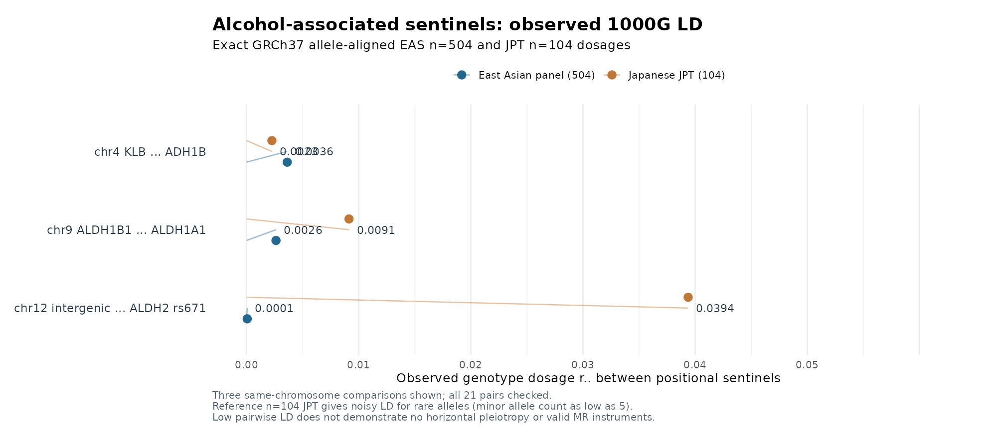

# IS alcohol GWAS: real East Asian/Japanese LD audit beyond ALDH2 rs671
**Date:** 2026-10-10 (KST)
**Branch:** `research/is-broad-discovery-20261009`
**Verdict:** **Seven exact GWAS variants validated in 1000G EAS504, with JPT104 sensitivity. Low empirical pairwise LD; MR exclusion restriction and cohort independence NOT satisfied/attested.**

## 1. Real sources and procedures

Starting from the already MD5-validated public Koyanagi Japanese alcohol intake GWAS, we retained six strongest, positionally spaced SNPs outside the ALDH2 locus after filtering 7,676,853 GWAS rows for genome-wide association, frequency and per-variant N. The source Japanese GWAS and GIGASTROKE East Asian ischemic stroke associations were exact allele-pair matched (five present, one absent in the AIS summary).

We then **actually extracted genotype calls** from the official `20130502` 1000 Genomes Phase 3 `v5b` GRCh37 chromosome-indexed `ALL.chrN...genotypes.vcf.gz` files hosted at `https://ftp.1000genomes.ebi.ac.uk/vol1/ftp/release/20130502/`, selecting **exactly 504 EAS individuals** with the original verified `EAS.samples.txt`. The 7 GWAS SNPs comprise chromosomes 2, 4, 9 and 12. We requested only exact SNP positions via `bcftools view -r` and converted all sample genotypes to allele-aligned ALT dosage. Each regional VCF is a small independently auditable source, not a synthesized result.

**Important real-world QC:** Four of seven SNPs have **REF/ALT swapped between the reference VCF and the GWAS**. Our source procedure checks allele pairs and computes **GWAS-ALT dosage = 2 − reference-VCF-ALT dosage** for reversed pairs. Simply dropping reversed variants would lead to a misleading 3/7 genotype coverage result. After correction:
- **7/7** exact GWAS allele-pair SNPs available
- 504 EAS samples per SNP, **0 missing genotypes**
- **4/7 REF/ALT swaps corrected**
- Verified identical ordering of all 504 sample IDs in each chromosome VCF against the official sample file
- A total of `7 choose 2` = **21 real cross-variant ALT dosage correlations** (sample Pearson signed r, (r^2) squared). Across chromosome pairs are merely finite-sample correlations, **not physical linkage**.

The actual 1000G phase 3 JPT subset is **104 Japanese individuals**, recovered via `integrated_call_samples_v3.20130502.ALL.panel` from the same 504 EAS set. Their precise genotypes were reused for a JPT-specific 21-pair sensitivity calculation. JPT n=104 has limited LD precision, especially for rare SNPs.

## 2. Empirical allele-aligned LD results

| Related genomic positional variants (GRCh37) | Physical separation | (r^2) EAS n=504 | (r^2) JPT n=104 |
|---|---:|---:|---:|
| `chr4:39413780 A>G` (KLB region) vs `chr4:100239319 T>C` (ADH1B region) | ~60.8 Mb | **0.003625** | **0.002260** |
| `chr9:38395928 T>C` (ALDH1B1) vs `chr9:75461066 T>C` (ALDH1A1 vicinity) | ~37.1 Mb | **0.002623** | **0.009133** |
| `chr12:106750302 A>G` vs `chr12:112241766 G>A` (ALDH2 rs671) | ~5.49 Mb | **0.0000575** | **0.039378** |

Across all 21 pairs, maximum EAS n504 (r^2 = 0.0110094), and maximum JPT n104 (r^2 = 0.0393777). Both are below conventional LD tagging thresholds like 0.1, but **this by itself is not full PLINK clumping of the entire alcohol GWAS** and is not sufficient to assert independent causal instruments.

In particular, JPT rs671/chr12 distal (r^2≈0.0394), while EAS combined is ≈0.0000575. This contrast warrants caution because the distal chr12 variant is rare (JPT minor allele count only **5 copies**). With n104 JPT individuals a small number of haplotypes can substantially change observed correlation. Report these as sensitivity checks rather than a confident difference between genetic populations.

## 3. Ancestry reference allele frequencies support correct orientation

| SNP GRCh37 | Japanese alcohol GWAS ALT EAF | 1KG EAS ALT frequency | 1KG JPT ALT frequency |
|---|---:|---:|---:|
| `2:27730940:T:C` | 0.4405 | 0.51885 | 0.41827 |
| `4:39413780:A:G` | 0.5796 | 0.52282 | 0.56250 |
| `4:100239319:T:C` | 0.2437 | 0.30258 | 0.26923 |
| `9:38395928:T:C` | 0.6576 | 0.61012 | 0.66346 |
| `9:75461066:T:C` | 0.9806 | 0.99206 | 0.97596 |
| `12:106750302:A:G` | 0.9784 | 0.98115 | 0.97596 |
| **ALDH2 rs671 `12:112241766:G:A`** | **0.2508** | **0.17361** | **0.24038** |

Maximum per-SNP absolute ALT EAF difference from the source Japanese GWAS is **0.07835 in combined EAS** versus **0.02553 in Japanese JPT**, providing a population-sensitive sanity check. The JPT–Japan match at rs671 is particularly clear (24.04% vs 25.08%). Note these frequencies are observational reference summaries, not proof of genotype imputation quality in the case/control GWAS.

## 4. Real LD does NOT prove valid MR exclusion restriction

The six non-ALDH2 positional sentinels were first screened from genome-wide exposure signals, each with a univariate `(beta/se)^2` **marginal F-proxy** of at least 31.8. The empirical seven-SNP cross-pair reference LD is low, and 5/6 non-ALDH2 sentinel variants are exact matching variants in the EAS AIS GWAS summary (none has individual outcome p<0.05, which is **not a reason to reject an otherwise valid MR instrument**).

Nonetheless, **0 MR-valid independent instruments have been attested** because:
1. `ADH1B`, `ALDH1B1`, `ALDH1A1` can influence alcohol/aldehyde metabolism outside the narrowly defined self-reported drinking amount exposure. `GCKR`, `KLB` can act via metabolic/endocrine pathways. This is genuine candidate *horizontal pleiotropy* concern.
2. Koyanagi Japanese source includes BBJ (134,993 participants of the drinking-status N175,672); overlap with BBJ stroke/BP and GIGASTROKE meta datasets has not been quantified. GIGASTROKE's BBJ held-out PGS evaluation does not prove the current EAS meta-outcome excludes all BBJ source participants.
3. No sex-specific independent Japanese/Korean exposure and stroke outcome summaries, and no independent AIS genetic replication sample, have been recovered.
4. The 1KG genotype audit checks only seven sentinel SNPs, not regional causal-variant conditional independence for every genome-wide significant alcohol-associated variant.
5. A candidate exposure association Z statistic can be strong and SNP–SNP LD small without proving the **exclusion restriction**, which is not testable directly from these summary datasets.
6. rs671 is a loss-of-function ALDH2 coding variant affecting alcohol tolerance and acetaldehyde/vascular pathways; it cannot be treated as an **alcohol-only instrument** without assumptions and sensitivity designs.

**No IVW, MR-Egger, weighted median, Cochran Q or causal mediated percentage** is reported in this phase. The pipeline retains original IS **2,225 positional gene universe**, so an ALDH2-focused mechanistic case study does not narrow primary stroke discovery.

## 5. Figure — ancestry-sensitive observed LD



The plot displays only three **within-chromosome** comparisons for readability; 18 other inter-chromosome pairs remain in the machine-readable complete table. It is **not** an MR estimation plot. Rare allele JPT sampling caution is included in its caption.

## 6. Reproduce

The branch contains only code, synthetic regression fixtures, readmes and small Figure PNG. It does **not** commit genotype data.

```bash
cd /srv/is-analysis/worktrees/is-broad-discovery-20261009
# Plan: no network
python3 scripts/is/extract_nonaldh2_alcohol_1kg_eas_ld.py --chrom all
# Exact 1KG EAS genotype extraction and 21 signed pairwise dosage correlations
python3 scripts/is/extract_nonaldh2_alcohol_1kg_eas_ld.py --chrom all --execute --calculate
# JPT104 versus EAS504 LD + allele frequency sensitivity
python3 scripts/is/audit_nonaldh2_alcohol_jpt_ld_sensitivity.py
# Join exposure F proxy, real EAS/JPT LD, 1KG allele orientation
python3 scripts/is/audit_is_nonaldh2_real_eas_ld_readiness.py
# Reproduce ancestry-sensitive LD figure
Rscript scripts/is/plot_is_alcohol_eas_jpt_ld_comparison.R
# Regression suite
OPENBLAS_NUM_THREADS=1 python3 -m unittest discover -s tests -p 'test_is_*' -q
```

Input/reference root: `/srv/is-analysis/data/is/ld_reference/nonaldh2_alcohol_eas_20261010/`

Central generated outputs:
- `IS_RS671_ALCOHOL_7SNP_REAL_EAS_LD_PAIRS.tsv`
- `IS_RS671_ALCOHOL_7SNP_REAL_EAS_LD_SUMMARY.json`
- `IS_RS671_7SNP_EAS504_JPT104_LD_SENSITIVITY.tsv`
- `IS_RS671_7SNP_EAS_JPT_ALLELE_FREQUENCIES.tsv`
- `IS_RS671_7SNP_JPT_SENSITIVITY_SUMMARY.json`
- `/srv/is-analysis/results/is/stage5_functional/broad_discovery_v1/expanded_reference_v2/g0022_full_locus_ais_v1/IS_NONALDH2_ALCOHOL_7SNP_EAS_REFERENCE_LD_IV_QC.tsv`
- `/srv/is-analysis/results/is/stage5_functional/broad_discovery_v1/expanded_reference_v2/g0022_full_locus_ais_v1/IS_NONALDH2_ALCOHOL_7SNP_EAS_REFERENCE_LD_IV_SUMMARY.json`

## 7. Next research gate

To progress beyond selected-SNP LD: fully region-based ancestry-aware PLINK 2 clumping using the complete set of Japanese exposure-GWS variants, fine-mapping or conditional F for multiple instruments, MR/Egger/IVW sensitivity using defensible independent outcome cohorts, colocalization with full molecular cis-QTL and tissue-specific functional/orthogonal ALDH2 validation. Do not claim that genomic distance or pairwise (r^2) alone proves instrument independence or the biological exclusion restriction.

**Primary data origin:** 1000 Genomes Phase 3 GRCh37 (International Genome Sample Resource), https://www.internationalgenome.org/data and `https://ftp.1000genomes.ebi.ac.uk/vol1/ftp/release/20130502/`. Japanese alcohol source Koyanagi et al. 2024 https://zenodo.org/records/10038152; original Korean KCPS2 2025 https://zenodo.org/records/15132424; GIGASTROKE AIS https://www.nature.com/articles/s41586-022-05165-3.
