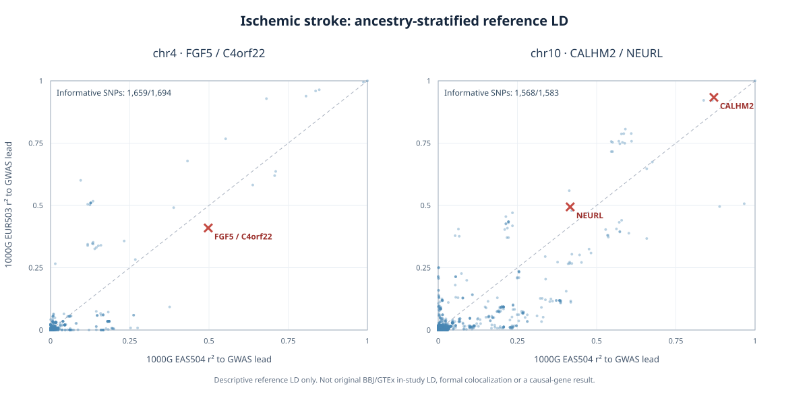

# IS priority-four ancestry-stratified reference LD comparison

**2026-10-11 KST — EXPLORATORY REFERENCE LD ONLY.** No causal gene, colocalization, or GTEx in-study LD validated.

## Inputs and genotype-level verification

Two archived BBJ IS original SNP input sets (GRCh37 `variant_id=chr:pos:REF:ALT`), chr4 BBJ_IS_L001 (1,694 variants) and chr10 BBJ_IS_L002 (1,583 variants), were extracted from 1000 Genomes **EAS504** existing reference PGEN and new indexed **EUR503** regional VCF (chr4 33,067 sites and chr10 34,744 sites). Both reference panels retained exactly the original 1,694 and 1,583 locus SNPs through PLINK 2 `--export A`; 504 EAS and 503 EUR distinct sample rows verified.

PLINK `.raw` can count REF, not ALT. The audit therefore interprets column suffix allele and converts all counts to **GRCh37 ALT dosage** (0/1/2). Failure to recognize or align counted allele is fatal. For example, chr4:80,681,087 G>C ALT EAF is **0.80556** in EAS504 and **0.54970** in EUR503, matching available population-reference metadata. All tested hardcall dosages were within 0–2 and the evaluated extracted arrays had no missing genotypes. Monomorphic or underpowered SNP–lead correlations were excluded from informative-r comparisons, not recorded as zero LD.

## GWAS lead vs strongest molecular QTL SNP in each gene (shared cis source SNPs)

Each lead is **the smallest GWAS p-value and smallest QTL p-value, respectively, among the original archived matched cis SNP rows in cerebellar hemisphere**; neither is asserted to be the full-study primary/conditionally independent signal. LD is between these two lead SNPs, allele-signed. The eQTL panels and GWAS datasets are not the same individuals as the reference.

| Locus | Gene | EAS504 signed r | EAS504 r² | EUR503 signed r | EUR503 r² |
|---|---|---:|---:|---:|---:|
| chr4 L001 | FGF5 | +0.7054 | 0.4976 | +0.6399 | 0.4095 |
| chr4 L001 | C4orf22 | +0.7054 | 0.4976 | +0.6399 | 0.4095 |
| chr10 L002 | CALHM2 | +0.9327 | 0.8700 | +0.9663 | 0.9336 |
| chr10 L002 | NEURL | +0.6453 | 0.4165 | +0.7030 | 0.4942 |

The relevant GWAS lead and molecular lead variant keys:
- **FGF5/C4orf22:** BBJ GWAS rs12509595 / GRCh37 `4:81182554:T:C`; strongest archived cerebellar-hemisphere molecular eQTL rs3733336 / `4:81207963:A:G`. FGF5 QTL P=1.0257e-6; C4orf22 QTL P=2.26293e-6.
- **CALHM2:** GWAS rs11191772 / `10:105459834:T:C`; QTL rs57694670 / `10:105447782:A:G`. QTL P=1.3617e-4.
- **NEURL:** GWAS rs11191772; QTL rs10883892 / `10:105397102:C:T`. QTL P=5.66816e-6.

## Across-locus evaluation

| Locus | Original shared SNP set | Informative r in both strata | Median absolute ALT EAF difference between ancestries | Fraction informative with absolute r² difference >0.2 |
|---|---:|---:|---:|---:|
| chr4 L001 | 1,694 | 1,659 | 0.1180 | 1.33% |
| chr10 L002 | 1,583 | 1,568 | 0.0708 | 4.59% |

Within the archived common SNP set, **the median absolute EAS-reference-versus-BBJ-GWAS MAF deviation** was 0.027 (chr4) / 0.028 (chr10). **EUR-reference-versus-GTEx-QTL median absolute MAF deviation** was 0.013 (chr4) / 0.020 (chr10). This should not be mistaken for donor-level genotype validation or matched LD.

## Validity limits

1. 1000 Genomes EAS504 approximates the BBJ Japanese stroke GWAS ancestry, and 1000 Genomes EUR503 approximates some GTEx ancestry mix but **neither is the original GWAS/QTL cohort**. The EAS vs EUR groups are distinct and unrelated to a directly replicated association.
2. FGF5/C4orf22's high QTL overlap may reflect shared regulatory architecture but r²≈0.4–0.5 is not formal colocalization; CALHM2's r²>0.8 is **LD tagging**, not shared causality or replication. EAS and EUR signed r may shift with population structure and sample composition.
3. Archived coloc.abf model uses first-SNP scalar QTL sample N; QTL N varied by SNP and posterior is sensitive to assumed p12. Neither issue is solved by reference LD.
4. Full locus/molecular cis tested variants and GTEx donor-matched LD remain scientifically unverified for multi-signal inference. Formal joint SuSiE-coloc **not executed**. Entire 2,225-gene positional search universe is retained.

## Reproducibility

Code: `scripts/is/audit_is_priority4_eas_eur_signed_ld.py`, regression tests `tests/test_is_priority4_eas_eur_signed_ld.py`. Original archived source input kept read-only.

Reference dosage exports, detailed 3,277-SNP row table, gene scorecard, locus QC and JSON manifest:
`/srv/is-analysis/results/is/audits/is_priority4_eur_eas_signed_ld_20261011_v1/`.

Next: verify signed LD vs independent PLINK pairwise r spot-check; compare frequency-based assay discordance; stage optional EAS/EUR LD sensitivity without claiming in-study GTEx LD, and assess candidate priorities across full 2,225 genes.

## Figure and independently verified reference-r cross-check

The figure plots each of the 3,277 unique locus SNPs; 3,227 were informative for signed LD to the GWAS lead in both strata. Reference r² from the current source panel was separately verified against original EUR503 compressed VCF hardcall GT genotypes via `bcftools query`: chr4 rs12509595 vs rs3733336 **r=+0.6399320692**, chr10 rs11191772 vs rs57694670 **r=+0.9662524320**, agreeing with the PLINK ALT-dosage pipeline. Plot renderer has no external plotting dependency: `scripts/is/render_is_priority4_reference_ld_figure.py`.
