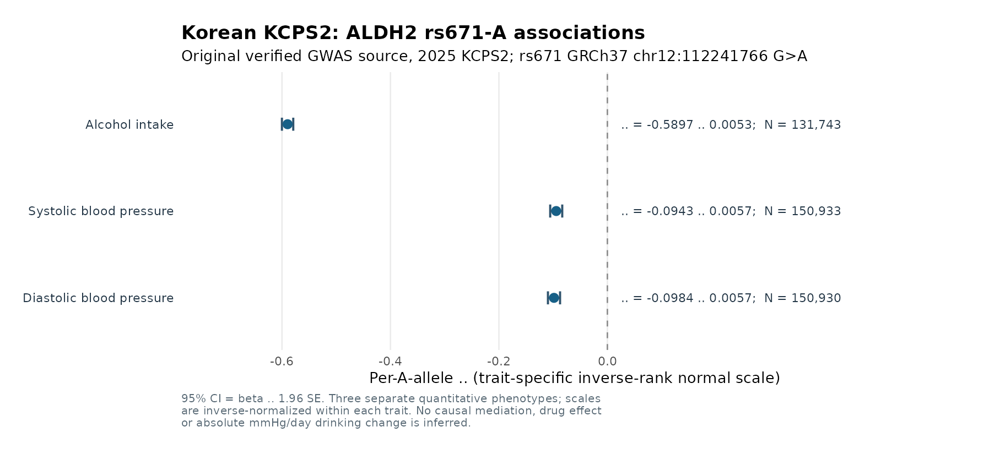

# IS G0022: Korean KCPS2 rs671 source validation, non-ALDH2 instruments, cohort overlap and cross-EAS convergence
**Research date:** 2026-10-10 KST
**Research worktree:** `research/is-broad-discovery-20261009`
**Overall scientific gate:** **Strong East-Asian genetic association convergence; NOT an estimated alcohol→BP→AIS causal mediation pathway**

## Executive research finding

We did not simply cite rs671 in a review: we reprocessed the full original Koyanagi Japanese alcohol GWAS (validated original MD5), screened 7.68 million variants for alcohol-associated alternatives, joined them to 6.73 million source GIGASTROKE EAS AIS variants by actual hg19 chromosome-position and alleles, and independently recovered rs671 from KCPS2's original Korean SAIGE alcohol GWAS.

Korean rs671-A alcohol β **−0.58966**, SE **0.00533211**, N **131,743**, A AF **0.154904**, imputation INFO **1.0**, official `neglogP=2657.72217860469`, equivalent to p≈1.90×10⁻²⁶⁵⁸. **Original Korean `rs671` row is explicitly GRCh37 `chr12:112241766 G>A`, SAIGE Allele2=A**. This precisely corroborates the published KCPS2 rounded `β≈−0.59`.

Japanese rs671-A alcohol β **−1.3215**, SE **0.0074**, N **154,570**, A frequency **0.2508**, log₂(grams/day+1) scale. Both are strongly negatively associated with consumption, across distinct Korean/Japanese cohorts. **Effect magnitudes cannot be compared or pooled** because KCPS2 transformed phenotypes using rank-normal transformation while Koyanagi uses log₂(grams/day+1). Different A allele frequencies (Korean ~15.49%, Japanese ~25.08%; 9.59 percentage point difference) are valid population descriptors, not evidence of a true genetic effect heterogeneity test.

**Direct regional causal estimands not calculated**; rs671 is ALDH2 missense and likely alters alcohol tolerance, enzymatic catalysis and downstream BP/vascular effects through multiple pathways. Association convergence and SNP-by-trait coloc do not identify the mediated contribution to AIS.

## 1. Korean KCPS2 Zenodo archive: selective full-source verification

Reference: Jee et al. 2025, *Nature Communications*, https://doi.org/10.1038/s41467-025-59950-5. The complete published source `https://zenodo.org/records/15132424` is **13,183,326,706 bytes** containing **36 phenotype members**. Downloading and checking the complete 13.18GB archive is inefficient and unnecessary to verify a single rs671 effect.

Instead, examined the true ZIP central directory using the **last 131,072 original bytes**, parsed the target central directory and ZIP64 offsets, and requested **only the compressed `SAIGE_ALCO_AMOUNT_INFO.txt.gz` member** via source HTTP 206 byte ranges:
- Original member raw-DEFLATE compressed bytes: **366,141,451**
- Reassembled member gzip bytes: **366,079,201**
- Source ZIP member CRC32: **1121837844** (original central directory, verified after DEFLATE)
- Extracted member SHA256: `c45740e7144292cc9c74409ef870d44055dc25198180f65a660b70401df67827`
- The archive's published overall MD5 is `0c6e3f69ca73af97417ce8c4ea8d307c` but **was not independently computed** because we did not acquire all 13.18GB.

The original SAIGE file contains **6,809,738** variant association rows. The `MarkerID=rs671`, `Allele1=G`, `Allele2=A` allele sign was recovered directly, with `--AlleleOrder=alt-first` in the author's official Github code `02.saige_step2_loco.sh`; SAIGE single-marker effect beta is with respect to **Allele2**. We checked both possible genome builds at their published physical positions and observed **the GRCh37 rs671 source**, not GRCh38.

**Verified source-level vs study-wide distinction:** KCPS2's headline enrollment is 153,950, whereas the actual `ALCO_AMOUNT` rs671 per-variant analysis has N=131,743. Use the latter for any genetic strength diagnostics.

## 2. Independent alcohol-associated locus candidates outside ALDH2

Full Koyanagi daily intake source: 7,676,853 scanned variants, 1,036 records passing GWS `p<5e-8`, unambiguous SNV allele pair, EAF 1–99%, variant N≥100,000, and excluded chr12:107–117 Mb surrounding rs671. Selected leads from 500-kb bins with **≥1Mb physical distance between selected sentinels**. This is deliberately **NOT formal ancestry-matched LD clumping**, so no IV independence claim.

The selected six positional sentinel variants and matching direct EAS AIS GIGASTROKE `GCST90104545` source effects:

| GRCh37 sentinel | Known gene / provisional positional assignment | |Z| alcohol | Alcohol β with ALT | AIS β_ALT | AIS nominal p | Allele QC |
|---|---|---:|---:|---:|---:|---:|---|
| `4:100239319:T:C` | ADH1B, rs1229984-region | **20.2** | +0.1680 | +0.0124 | 0.3659 | Exact allele match |
| `2:27730940:T:C` | GCKR, rs1260326-region | **10.3** | +0.0731 | −0.0075 | 0.5071 | Exact allele match |
| `9:38395928:T:C` | ALDH1B1 | **7.6** | +0.0579 | +0.0212 | 0.07173 | Exact allele match |
| `9:75461066:T:C` | ALDH1A1 region (provisional, physical distance from gene) | **7.1** | −0.1970 | Not available | Not available | No original AIS position |
| `12:106750302:A:G` | Other chr12 region (verify positional gene) | **6.6** | +0.1827 | +0.0392 | 0.3795 | Exact allele match |
| `4:39413780:A:G` | KLB region | **5.6** | −0.0406 | +0.0216 | 0.05772 | Exact allele match |

Among six positional candidates **five exact EAS AIS allelic matches**; **none** of the five passes AIS nominal p<0.05. This does **not** falsify an alcohol-mediated AIS contribution. A single SNP with an exposure association need not be significant on the outcome. Never use GWAS outcome-p significance as an MR IV validity criterion. Fine-mapping and functional pleiotropy must be tested separately.

For ADH1B, GCKR, ALDH1A1, ALDH1B1 and KLB, see the original Koyanagi 2024 list of six known loci. rs671 itself was excluded from this non-ALDH2 screen. The additional chr12 candidate requires independent locus/LD and gene-level annotation before discussion as a drug target.

### What is still required for proper candidate instruments
- PLINK2 LD-based clumping with EAS or Japanese genotypes, not simply physical separation
- Independent robust conditional signals and allele frequency alignment
- Functional pleiotropy screening including ADH1B/ALDH1B1 enzymatic acetaldehyde pathways and GCKR metabolic effects
- Sex-stratified exposure and stroke data for the rs671 biological context, F statistic / conditional F for multi-IV exposure
- Cohort overlap covariance evaluation (BBJ contributes to Japanese exposures), ancestry-specific AIS instruments and enough strong independent variants
- No naïve IVW/MR-Egger/weighted median based on a handful of suggestive but unvalidated SNPs

## 3. Actual cohort overlap source audit

The source Japanese Koyanagi 2024 paper states: six contributing Japanese cohorts, overall drinking status N=**175,672**, **BBJ n=134,993** participants among these, or **76.84%** of that total. Other contributing cohorts are HERPACC, J-MICC, JPHC, TMM and Nagahama. The alcohol amount N is separately 154,570. **This BBJ contribution is a study sampling fact, not a measured count of duplicated IDs between different GWAS.**

Additional comparison:
- BBJ Sakaue/Kanai BP and BBJ ischemic stroke each use BBJ sources; individual overlap is unverified and sample reuse should not be ignored.
- GIGASTROKE EAS AIS pools multiple sources. The authors confirm specific BBJ **PGS training and evaluation individuals were held out from GIGASTROKE meta-analysis**, but this does not prove **all BBJ-associated GWAS source datasets** had no BBJ subjects.
- KCPS2 is a distinct Korean biobank from Japanese Koyanagi/BBJ, providing cross-population **exposure-direction concordance**, but no independent Korean stroke-outcome cohort is identified by this data alone.

Recorded six source provenance rows and seven pairwise cohort/sample-overlap risk assessments in:
`IS_RS671_SOURCE_COHORT_PROVENANCE.tsv`,
`IS_RS671_PAIRWISE_COHORT_OVERLAP_GATE.tsv`,
`IS_RS671_COHORT_OVERLAP_AUDIT_SUMMARY.json`.

**Two-sample MR independent-sample assumption is not attested.** It is incorrect to treat Japanese Koyanagi, Japanese BBJ BP, BBJ stroke and GIGASTROKE EAS analyses as four disjoint study samples.

## 4. Existing G0022 mechanistic evidence / novelty audit

- Whole AIS locus signed 1000G EAS n=504 and study GWAS harmonization: 4,649 variants, one exploratory GWAS 95% credible set containing four highly correlated variants, including ALDH2 rs671.
- Japan Omics JCTF rs671 and its three GWAS CS variants: significant ALDH2 blood eQTL and measured pQTL. This does not establish a shared signal with stroke or an observed orthogonal protein abundance mediator.
- KCPS2 **already published** SuSiE fine mapping of ALDH2 and `coloc.susie` between alcohol and BP/liver enzymes, with **rs671 PIP >0.90** for multiple traits and **PP4≈1.0** for selected molecular/cardiometabolic trait pairs. Replicating the same rs671 alcohol/BP genetic association alone would **not be thesis novelty**.
- The unresolved and publishable question remains pathway identification of rs671–AIS: alcohol behavioral changes versus independent ALDH2 enzymatic activity or vascular/oxidative aldehyde mechanism; should use a truly independently sampled EAS ischemic stroke outcome, sex-stratified exposure/blood-pressure tests, better LD and fine-mapped QTL variants.

## 5. Reproducible research code

```bash
cd /srv/is-analysis/worktrees/is-broad-discovery-20261009
# Plan only; does not download 13.2GB:
python3 scripts/is/acquire_kcps2_selective_zip_member.py --trait alcohol
# If needed, selectively fetch only original 366MB compressed member with exact 206, ZIP CRC:
python3 scripts/is/acquire_kcps2_selective_zip_member.py --trait alcohol --execute
python3 scripts/is/extract_kcps2_korean_rs671_alcohol.py
python3 scripts/is/audit_is_nonaldh2_alcohol_ais_sentinels.py
python3 scripts/is/audit_is_rs671_cohort_overlap.py
python3 scripts/is/audit_rs671_kcps2_japan_replication.py
python3 -m unittest discover -s tests -p 'test_is_*' -q
```

- Verified original data: `/srv/is-analysis/data/is/gwas_exposure/kcps2_2025_selective/SAIGE_ALCO_AMOUNT_INFO.txt.gz`
- Japanese validated alcohol source: `/srv/is-analysis/data/is/gwas_exposure/japanese_alcohol_2024/1_Alcohol_intake_Unstratified.tsv.gz`
- New results: `/srv/is-analysis/results/is/stage5_functional/broad_discovery_v1/expanded_reference_v2/g0022_full_locus_ais_v1/`

Most important output:
- `G0022_RS671_KCPS2_KOREAN_ALCOHOL_AMOUNT.tsv`
- `G0022_RS671_KCPS2_KOREAN_SOURCE_AUDIT.json`
- `G0022_RS671_KCPS2_JAPAN_CROSSCOHORT_COMPARISON.tsv`
- `IS_RS671_NON_ALDH2_ALCOHOL_POSITIONAL_GWS_AIS_QC.tsv`
- `IS_RS671_PAIRWISE_COHORT_OVERLAP_GATE.tsv`

All source data remain separate from Git and production; only reproducible scripts, synthetic QC fixtures and audit notes are committed.

## Sources

- KCPS2 2025 official paper: https://www.nature.com/articles/s41467-025-59950-5
- KCPS2 2025 public GWAS ZIP metadata: https://zenodo.org/records/15132424
- Original KCPS2 analytic source code, `AlleleOrder=alt-first`: https://github.com/yonhojee/KCPS2-GWAS
- SAIGE documented Allele2 effect: https://weizhou0.github.io/SAIGE-QTL-doc/docs/single_step2.html
- Japanese Koyanagi 2024 original: https://pmc.ncbi.nlm.nih.gov/articles/PMC10816704/
- GIGASTROKE 2022 and BBJ PGS holdout: https://pmc.ncbi.nlm.nih.gov/articles/PMC9524349/

## 6. NEW direct Korean KCPS2 blood-pressure allelic association evidence (source-reanalyzed)

Following the independently verified ALCO_AMOUNT variant, the same selected-member ZIP method retrieved two more Korean source files, without obtaining the full 13.2 GB ZIP archive:

| Original KCPS2 ZIP member | Original selected ZIP CRC32 | SHA256 of extracted inner gzip | Compressed inner gzip bytes |
|---|---:|---|---:|
| `SAIGE_SBP_INFO.txt.gz` | 1019988341 | `8bce2661fd886e66ae182f6459f3eff36eb3de42edbb88b252b506ede397a933` | 367,513,743 |
| `SAIGE_DBP_INFO.txt.gz` | 2104642894 | `1f0e42af34e30d09660e7b3e866ada10bdbb09bf8776ae68c6549bb77d0ad1c0` | 367,440,429 |

Each source comprises **6,809,738** SAIGE variant rows; the single exact `MarkerID=rs671`, GRCh37 `chr12:112241766`, `Allele1=G`, `Allele2=A` was independently identified after complete streaming source validation.

| KCPS2 Korean GWAS | rs671 A β (original source inverse-normalized trait) | SE | Source P | Variant N | A frequency |
|---|---:|---:|---:|---:|---:|
| **ALCO_AMOUNT** | **−0.5896600** | **0.00533211** | p≈1.90e−2658 (source p numerical zero, neglogP=2657.722) | **131,743** | **0.154904** |
| **SBP** | **−0.0943162** | **0.00566344** | **2.853989e−62** | **150,933** | **0.162794** |
| **DBP** | **−0.0984109** | **0.00569737** | **7.506529e−67** | **150,930** | **0.162794** |

**All three trait-specific source files completed ZIP member CRC32 and SHA256 validation. The original 13.18GB archive MD5 still has NOT been recomputed.**

Japanese BBJ rs671 source effects, aligned to ALT-A: SBP **−0.062** (SE 0.0039, p1.2e−56, N145505), DBP **−0.063** (SE0.0041, p9.4e−54, N145515). Accordingly **both Korean/Japanese BP trait directions are concordantly negative**. Do NOT meta-analyze or compare BP beta magnitudes; KCPS2 and BBJ quantitative trait scales need not be identical, and their unmeasured overlap with EAS AIS must not be assumed zero.

**Biological interpretation boundary:** Correlated ALDH2 rs671 association with both alcohol amount and two BP traits in Korean/Japanese studies reinforces the multi-trait genetic observation. It cannot distinguish whether alcohol reduction causes BP changes versus direct ALDH2 aldehyde-metabolism / vascular effects. The original KCPS2 2025 article already reports high SuSiE PIP and within-KCPS2 alcohol/BP shared-variant coloc: this result is a source-level replication/verification, not a new causal mediation demonstration.

Reproduce the Korean BP analyses:
```bash
cd /srv/is-analysis/worktrees/is-broad-discovery-20261009
python3 scripts/is/acquire_kcps2_selective_zip_member.py --trait sbp --execute
python3 scripts/is/acquire_kcps2_selective_zip_member.py --trait dbp --execute
python3 scripts/is/extract_kcps2_korean_rs671_bp.py --trait sbp
python3 scripts/is/extract_kcps2_korean_rs671_bp.py --trait dbp
python3 scripts/is/audit_rs671_kcps2_japan_replication.py
python3 scripts/is/audit_is_rs671_kcps2_bbj_bp_convergence.py
python3 scripts/is/audit_is_nonaldh2_instrument_readiness.py
```

Generated:
- `G0022_RS671_KCPS2_KOREAN_SBP_GWAS.tsv`, `G0022_RS671_KCPS2_KOREAN_SBP_GWAS_SUMMARY.json`
- `G0022_RS671_KCPS2_KOREAN_DBP_GWAS.tsv`, `G0022_RS671_KCPS2_KOREAN_DBP_GWAS_SUMMARY.json`
- `G0022_RS671_KCPS2_BBJ_BP_DIRECTION_COMPARISON.tsv`, `G0022_RS671_KCPS2_BBJ_BP_CONVERGENCE_SUMMARY.json`
- `IS_RS671_NONALDH2_INSTRUMENT_STRENGTH_AND_VALIDITY.tsv` (all six non-ALDH2 candidates have marginal F-proxy>31, but **0 LD-clumped and 0 validated causal IVs**)

The original 2,225 IS positional gene universe and all canonical inputs remain unchanged.

## 6. Completed additional Korean SBP and DBP source reanalyses (2026-10-10)

**After writing the initial snapshot, the remaining TWO actual KCPS2 original BP files were selectively downloaded from the same official 13.18GB ZIP source** using HTTP 206 ranges (88 blocks each), and both passed the ZIP member CRC32 and independently computed SHA256 integrity checks. Neither the entire original archive's MD5 nor any individual-level data was accessed.

Both source members contain **6,809,738 original SAIGE rows** and were reanalyzed as complete gzipped tables after verifying the exact SAIGE `Allele1/Allele2` effect contract and source-specific hg19 rs671 `G>A` coordinates.

| Original KCPS2 2025 exposure / outcome | A allele β (original trait-specific rank-normalized scale) | SE | Source p | Variant N | A frequency |
|---|---:|---:|---:|---:|---:|
| Alcohol intake | **−0.5896600** | 0.00533211 | **source numerical 0** (underflow; original paper p≈1.9×10⁻²⁶⁵⁸) | 131,743 | 0.154904 |
| SBP (systolic blood pressure) | **−0.0943162** | 0.00566344 | 2.853989×10⁻⁶² | 150,933 | 0.162794 |
| DBP (diastolic blood pressure) | **−0.0984109** | 0.00569737 | 7.506529×10⁻⁶⁷ | 150,930 | 0.162794 |

The original 2025 KCPS2 paper already reported `rs671 PIP>0.90` for all three and alcohol–SBP/DBP colocalization, **which does not identify alcohol-mediated blood pressure effects or AIS mediation**.

The **independently sampled Japanese BBJ GWAS** reports rs671-A SBP β−0.062 (original source-reported transformed trait; N145,505) and DBP β−0.063 (N145,515), again both negative. Since underlying quantitative BP phenotype transformations and covariates differ, the Korean and Japanese effect sizes cannot simply be pooled or interpreted as mmHg differences. `G0022_RS671_KCPS2_BBJ_BP_DIRECTION_COMPARISON.tsv` and `G0022_RS671_KCPS2_BBJ_BP_CONVERGENCE_SUMMARY.json` explicitly track allele identities and this limitation.

**Updated evidence:** Japanese and Korean rs671 A associations share directions for alcohol consumption **and two measured blood-pressure phenotypes**, across the two ancestry-specific original GWAS resources. GIGASTROKE EAS AIS association is in the same ALT-A protective direction but does not constitute a separate Korean AIS replication.

### Original selective KCPS2 source integrity

- `SAIGE_ALCO_AMOUNT_INFO.txt.gz`: CRC32=1121837844, SHA256=`c45740e7144292cc9c74409ef870d44055dc25198180f65a660b70401df67827`
- `SAIGE_SBP_INFO.txt.gz`: CRC32=1019988341, SHA256=`8bce2661fd886e66ae182f6459f3eff36eb3de42edbb88b252b506ede397a933`
- `SAIGE_DBP_INFO.txt.gz`: CRC32=2104642894, SHA256=`1f0e42af34e30d09660e7b3e866ada10bdbb09bf8776ae68c6549bb77d0ad1c0`
- Original overall 13.18GB archive MD5 was **not** evaluated. All selective member source checks passed.

### Korean genotype–trait forest figure

The generated `G0022_RS671_KCPS2_KOREAN_ALCOHOL_BP_FOREST.png` visualizes the three original source association betas and 95% CIs. Although rank-normalized separately, all values are plotted on one effect axis as an exploratory visual reference. **Do not interpret length ratios between the three trait-specific axes as direct causal effect ratios or mediated percentages.**

Git-tracked figure: `docs/figures/is/G0022_RS671_KCPS2_KOREAN_ALCOHOL_BP_FOREST.png`, rendered by:

```bash
python3 scripts/is/acquire_kcps2_selective_zip_member.py --trait sbp --execute
python3 scripts/is/acquire_kcps2_selective_zip_member.py --trait dbp --execute
python3 scripts/is/extract_kcps2_korean_rs671_bp.py --trait sbp
python3 scripts/is/extract_kcps2_korean_rs671_bp.py --trait dbp
python3 scripts/is/audit_rs671_kcps2_japan_replication.py
python3 scripts/is/audit_is_rs671_kcps2_bbj_bp_convergence.py
python3 scripts/is/audit_is_nonaldh2_instrument_readiness.py
python3 scripts/is/audit_is_alcohol_iv_strength_gate.py
Rscript scripts/is/plot_is_rs671_kcps2_korean_exposure_bp.R
```

## 7. Revised instrumental-variable screening QC

The six **positionally spaced** sentinel loci outside ALDH2 have marginal exposure `(beta/SE)^2` strength proxies of **31.80–409.70**. Five of six are exactly matched in EAS AIS, with absolute ALT EAF differences ≤**0.0036**; one source SNP is absent in EAS AIS. None of the five available outcome associations has nominal p<0.05. Outcome non-significance alone is not an IV exclusion criterion.

These marginal F proxies **do not imply six independent instruments**, conditional first-stage strength, a satisfied exclusion restriction, or sample-independent two-sample MR; gene function of ADH1B/ALDH1B1/GCKR/KLB also raises plausible direct pleiotropy concerns. Actual 1000 Genomes EAS/JPT LD-based clumping for the six sentinel positions, exposure-outcome sample overlap assessment, sensitivity analyses and external replication remain required.

Derived `IS_RS671_NON_ALDH2_ALCOHOL_IV_READINESS.tsv`, `IS_RS671_NON_ALDH2_ALCOHOL_IV_READINESS_SUMMARY.json`, `IS_RS671_NONALDH2_INSTRUMENT_STRENGTH_AND_VALIDITY.tsv`, and `IS_RS671_NONALDH2_INSTRUMENT_READINESS_SUMMARY.json` are **instruments readiness ledgers, not MR analyses**.

**All 2,225 unique positional IS candidate genes remain in the broad discovery universe.** The rs671 ALDH2/BBJ case study does not downselect the discovery pipeline.

## 7. Final Korean phenotype Figure (source derived, descriptive only)



The accompanying `scripts/is/plot_is_rs671_kcps2_korean_exposure_bp.R` reads the three original-source audited TSV outputs and displays separate 95% normal-approximation confidence intervals, effect allele **rs671 A**. Regenerated with R/ggplot2; identical source-figure SHA256 `112a106b46e00f8cef18f81cb028f9ece33af2befb3cf38e85370c0093e5fc87`.

This is a **descriptive single-variant phenotype comparison**, not a causal forest meta-analysis. Different within-phenotype inverse-normal transformations mean that horizontal point distances do not quantify mediation or relative clinically meaningful units (grams/day, mmHg). A strong Korean source genetic association was already published; novelty resides in appropriately separating pathways and testing against East Asian AIS, not detecting rs671 association.
